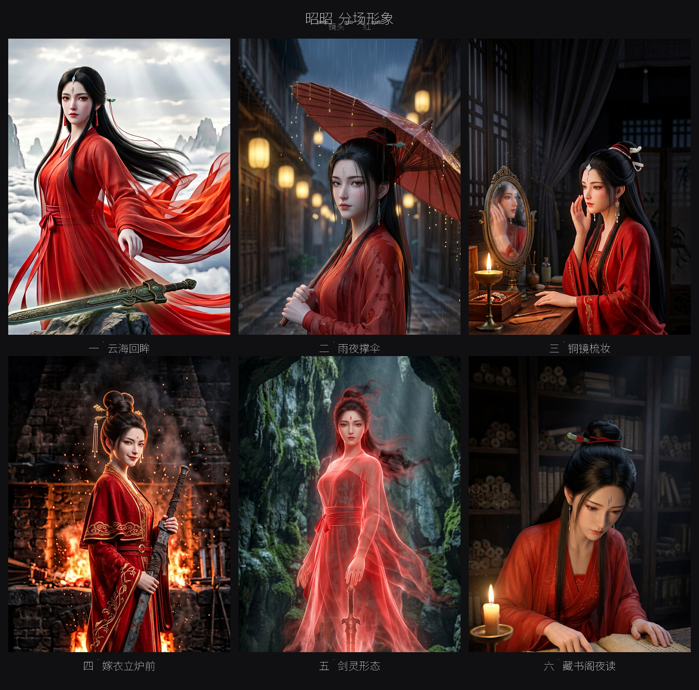
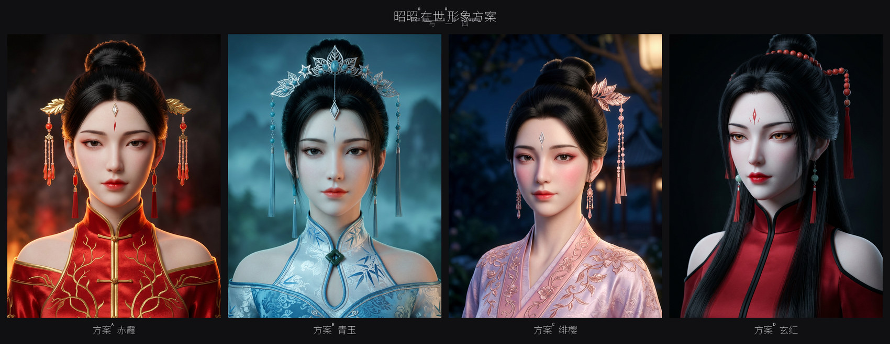

# 短剧创作产出 · 红妆铸剑

用本仓库内置技能包（`packages/instructions/pkg/pack/builtin/assets/skills/`）生成的短剧创作产出，可作为技能实际输出的参考样例。

## 作品

**《红妆铸剑》** — 修仙世界短剧，第一人称叙述（男主无咎视角）。

- **梗概**：盲眼剑士无咎立敌无数，昭昭查得禁忌古籍后以身入铸剑炉、化为认主神器，成为他手中之剑。他一直不知手里握着的是谁，直到魔修围杀那一夜剑灵燃魂开口。剑战死失踪百年，实则一直在寻他的转世。
- **时长**：67 秒 / 31 镜 / 7 组

## 文件

| 文件 | 对应技能 | 内容 |
|---|---|---|
| [分镜.md](分镜.md) | `storyboard-writer` | 31 镜 / 7 组 / 67 秒，面向 Seedance 2.0，含逐镜视点标注与混音铁律 |
| [角色设定.md](角色设定.md) | `character-writer` | 6 个形态条目（昭昭 3 / 无咎 3），含跨镜头识别特征 |
| [场景设定.md](场景设定.md) | `scene-writer` | 7 个纯净无人场景，各附可复制生图 Prompt |
| [道具设定.md](道具设定.md) | `prop-writer` | 5 件道具（剑 / 黑布 / 古籍 / 追杀令 / 温酒碗），含连续性标记 |

## 形象参考图

画风：3DCG 国漫电影级半写实渲染。以下均为**概念参考图**，用于确定画风与造型方向；正式制作前需先锁定基准脸，避免跨镜头五官漂移。

### 分场形象

| 场景 | 对应分镜 | 图片 |
|---|---|---|
| 云海回眸 | 镜 01 | [场景1-云海回眸.jpg](img/场景1-云海回眸.jpg) |
| 雨夜撑伞 | 走马灯帧 | [场景2-雨夜撑伞.jpg](img/场景2-雨夜撑伞.jpg) |
| 铜镜梳妆 | 走马灯帧 | [场景3-铜镜梳妆.jpg](img/场景3-铜镜梳妆.jpg) |
| 嫁衣立炉前 | 镜 30 | [场景4-嫁衣立炉前.jpg](img/场景4-嫁衣立炉前.jpg) |
| 剑灵形态 | 镜 28 | [场景5-剑灵形态.jpg](img/场景5-剑灵形态.jpg) |
| 藏书阁夜读 | 镜 13、14 | [场景6-藏书阁夜读.jpg](img/场景6-藏书阁夜读.jpg) |

### 配色方案

| 方案 | 配色 | 建议用途 |
|---|---|---|
| [方案A 赤霞](img/方案A-赤霞.jpg) | 正红 + 金线 | 在世主设定（金饰版），记忆中最亮的时刻 |
| [方案B 青玉](img/方案B-青玉.jpg) | 月白青碧 + 银 | 旁人视角的"修真界第一美人"传闻段落 |
| [方案C 绯樱](img/方案C-绯樱.jpg) | 藕荷暖粉 + 玫瑰金 | 日常温柔段落 |
| [方案D 玄红](img/方案D-玄红.jpg) | 绯红 + 墨黑 | 入炉嫁衣与剑灵形态（卸去金饰，只留红与黑） |

> **A + D 组合建议**：在世的日常用 A（金饰版）以保证记忆画面夺目；入炉嫁衣改用 D（卸去所有金饰）——"她把金饰摘了"这个动作本身即是叙事。剑灵形态沿用 D 的红裙轮廓做半透明化，剪影连贯。

## 一致性锚点（跨文件共用）

- 昭昭：朱红交领广袖长裙，腰间红缎带结在左侧；左耳后发际一颗小痣；右手中指第二关节内侧一道浅色细疤。
- 无咎：眼上黑布永不摘除（布宽三指、绕头两圈、脑后偏左死结）；右手虎口深色旧疤；斗篷左后下摆一块补丁。
- 剑：剑首剑格素面无饰，缠柄布人字形、收尾布结在柄身下三分之一；剑脊内侧一线极淡红光；剑脊旧缺口凡铁状态存在、神器状态起永久消失。

## 已知待修

以下问题已在评审中记录，修订后需重出对应图片：

- **场景4 嫁衣立炉前**：出现了剧本未写的面部血迹；手部动作为"持剑"而剧本要求"双手抱剑"；剑应为暗灰有锈斑的旧剑（含剑脊缺口），当前出图为全新剑。
- **场景5 剑灵形态**：红光应自剑柄向上衰减，当前为均匀包裹；背景应为洞口光带而非洞内深处。
- **画风一致性**：六张分场图五官存在漂移，正式制作前需锁定基准脸并出四视图。
